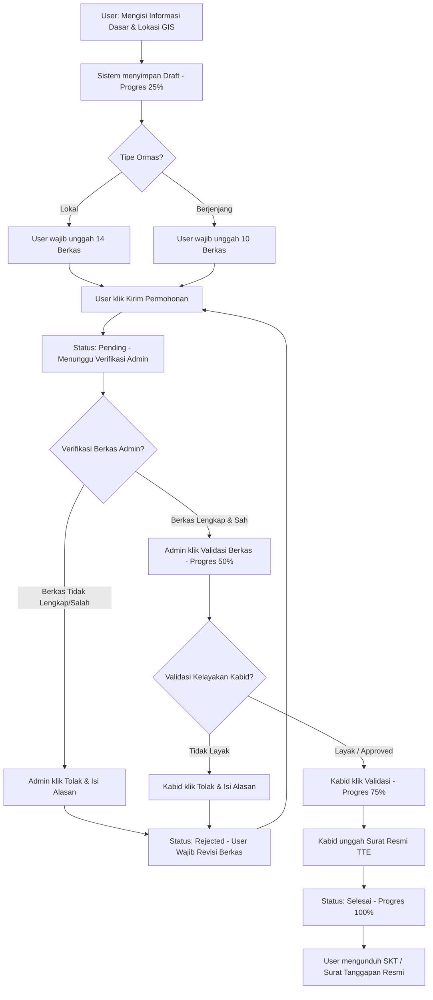
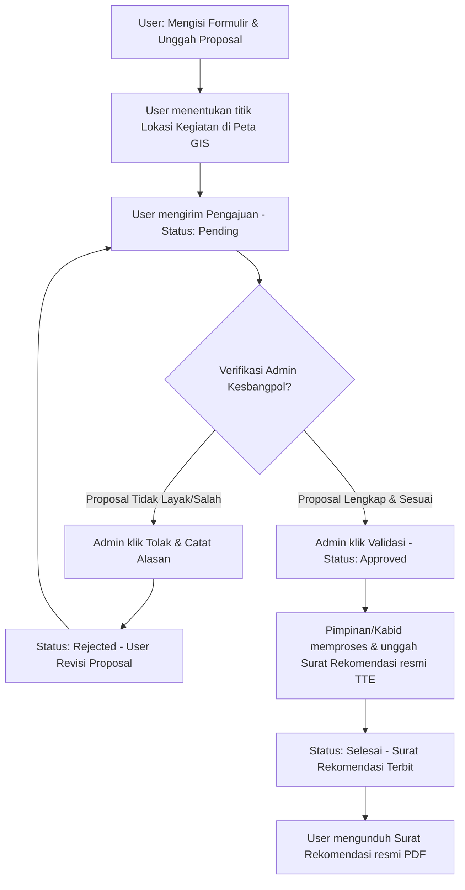
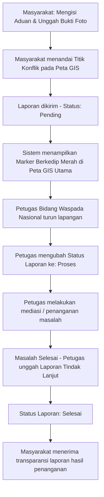

# DOKUMENTASI ALUR SISTEM - SIPAKATAU

Dokumen ini menjelaskan alur operasional utama pada aplikasi SIPAKATAU (Sistem Pelayanan Ormas, Rekomendasi Kegiatan, dan Pengaduan Masyarakat) Badan Kesbangpol.

---

## 1. ALUR PENDAFTARAN ORMAS (LOKAL & BERJENJANG)

Alur pendaftaran organisasi kemasyarakatan dari penginputan draf oleh pengurus ormas (User), verifikasi berkas oleh Admin, validasi kelayakan oleh Kabid Poldagri, hingga penerbitan dokumen resmi (SKT/Tanggapan).

### Bagan Alir (Flowchart)

### Penjelasan Detail Langkah-Langkah:
1. **Pendaftaran Awal (Progres 25% - Draft)**:
   - **User** menginput data nama ormas, alamat sekretariat, kontak email/telepon, detail kepengurusan (Ketua, Sekretaris, Bendahara), serta unggahan KTP dan Pasfoto masing-masing pengurus.
   - **User** menentukan titik lokasi kantor sekretariat pada peta GIS secara presisi.
   - Sistem menyimpan data sebagai draf awal dan meningkatkan status akun pengguna menjadi role `ormas`.
2. **Unggah Dokumen Syarat (Progres 25% - Pending)**:
   - User harus melengkapi seluruh dokumen persyaratan wajib sebelum dapat mengirimkannya ke admin.
   - **Ormas Lokal** wajib melampirkan **14 jenis dokumen** (Surat permohonan menteri, AD/ART, Akta notaris, Domisili, dll.).
   - **Ormas Berjenjang** wajib melampirkan **10 jenis dokumen** (Surat permohonan kaban, SK kemenkumham, domisili, foto papan nama, dll.).
3. **Verifikasi Admin (Progres 50% - Pending)**:
   - **Admin Kesbangpol** memvalidasi kesesuaian berkas ormas yang diunggah.
   - Jika berkas salah/tidak sesuai, Admin menolak pengajuan dengan menyertakan catatan alasan. Status pengajuan diturunkan menjadi **Rejected (Revisi)**.
   - Jika berkas lengkap, Admin menekan tombol **Validasi Berkas** sehingga progres naik menjadi **50%**.
4. **Validasi Kabid Poldagri (Progres 75% - Approved)**:
   - Pengajuan masuk ke dasbor Kabid Poldagri pada menu **Penerbitan SKT / Tanggapan**.
   - Kabid dapat melihat profil pengirim dan meninjau berkas yang diunggah secara retrospektif (menggunakan tombol mata/Lihat Berkas).
   - Kabid menentukan kelayakan ormas. Jika disetujui, Kabid mengklik tombol **Validasi**, dan progres naik ke **75% (Approved)**.
5. **Penerbitan Dokumen (Progres 100% - Selesai)**:
   - Kabid mengunggah berkas resmi yang telah dibubuhi TTE (Tanda Tangan Elektronik):
     - Berkas **Laporan Tanggapan Keberadaan** untuk Ormas Lokal.
     - Berkas **Surat Keterangan Keberadaan** untuk Ormas Berjenjang.
   - Setelah dokumen diunggah, progres pendaftaran ormas dinyatakan selesai (**100%**). Surat resmi kini tampil di halaman riwayat akun User untuk dapat diunduh kapan saja.

---

## 2. ALUR REKOMENDASI KEGIATAN

Alur ini melayani pengajuan surat rekomendasi pelaksanaan kegiatan kemasyarakatan dari ormas atau perwakilan masyarakat kepada Kesbangpol.

### Bagan Alir (Flowchart)

### Penjelasan Detail Langkah-Langkah:
1. **Pengajuan Rekomendasi**:
   - **User** mengisi detail kegiatan meliputi Nama Pemohon, Nama Kegiatan/Tema, Rentang Tanggal Mulai dan Selesai Kegiatan, serta Deskripsi Kegiatan.
   - **User** mengunggah file proposal kegiatan dalam format PDF.
   - **User** menentukan titik lokasi pelaksanaan kegiatan pada peta GIS secara presisi.
2. **Verifikasi Admin**:
   - **Admin Kesbangpol** meninjau keabsahan dan tujuan proposal kegiatan.
   - Jika ditolak, status berubah menjadi **Rejected** dan wajib direvisi.
   - Jika disetujui, admin memvalidasi status rekomendasi kegiatan menjadi **Approved**.
3. **Penerbitan Surat Rekomendasi**:
   - Pimpinan atau Kabid memproses dokumen fisik Surat Rekomendasi Kegiatan resmi yang telah ditandatangani.
   - Surat resmi tersebut diunggah ke dalam sistem, dan status pengajuan diperbarui menjadi selesai.
   - **User** mengunduh dokumen Surat Rekomendasi Kegiatan (PDF) secara mandiri dari akun mereka.

---

## 3. ALUR PENGADUAN MASYARAKAT

Alur pelaporan potensi konflik sosial, kerawanan wilayah, atau aduan umum masyarakat kepada Badan Kesbangpol Sinjai sebagai bagian dari Sistem Peringatan Dini (*Early Warning System*).

### Bagan Alir (Flowchart)

### Penjelasan Detail Langkah-Langkah:
1. **Pengiriman Laporan**:
   - **Masyarakat/User** menulis kronologi pengaduan, subjek masalah, serta mengunggah bukti foto pendukung di lapangan.
   - **Masyarakat/User** mengeklik titik lokasi tepat terjadinya konflik pada peta GIS agar koordinat *Latitude* dan *Longitude* tercatat secara presisi.
   - Laporan dikirimkan ke dalam sistem dengan status awal **Pending**.
2. **Early Warning System (EWS) & Deteksi Awal**:
   - Dasbor Utama Kesbangpol dan Bidang Kewaspadaan Nasional menerima notifikasi laporan masuk.
   - Peta GIS sebaran konflik secara real-time memunculkan marker penanda (berkedip warna merah jika tingkat kerawanannya tinggi) di titik koordinat yang dilaporkan.
3. **Penanganan Lapangan & Tindak Lanjut**:
   - Petugas Bidang Waspada berkoordinasi dengan aparat terkait untuk meninjau lokasi kejadian.
   - Petugas mengubah status penanganan di sistem menjadi **Proses** (sedang ditangani).
   - Setelah mediasi atau masalah sosial terselesaikan, petugas menyusun dokumen laporan tindak lanjut.
   - Petugas mengunggah laporan hasil tindak lanjut tersebut dan memperbarui status laporan menjadi **Selesai**.
   - Pelapor mendapatkan transparansi penuh dan dapat membaca laporan penyelesaian masalah tersebut dari halaman riwayat aduan mereka.
