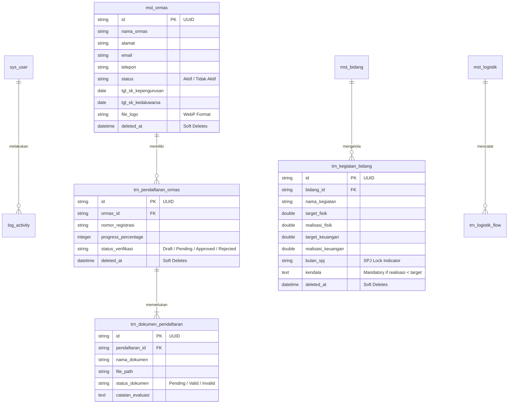
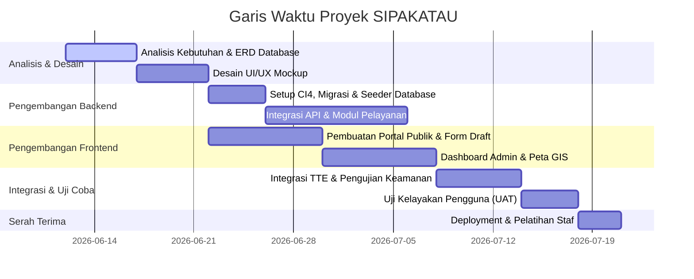

# PROPOSAL PENGEMBANGAN APLIKASI WEB "SIPAKATAU"
### Sistem Pelayanan Kesbangpol Terpadu dan Akurat
**Klien:** Badan Kesatuan Bangsa dan Politik (Kesbangpol) Kabupaten Sinjai  
**Pengembang:** Software House & Diskominfo Sinjai  
**Dokumen Versi:** 1.0  
**Tanggal:** 12 Juni 2026

---

> [!NOTE]
> **SIPAKATAU** dirancang sebagai portal pelayanan terpadu satu pintu (PTSP) untuk internal maupun eksternal Badan Kesbangpol Kabupaten Sinjai. Proposal ini disusun berdasarkan analisis mendalam terhadap file rancangan fitur final dan mengintegrasikan seluruh aturan arsitektur, database, keamanan, dan standar visual Diskominfo Sinjai.

---

## 1. Arsitektur & Teknologi Stack

Aplikasi SIPAKATAU akan dibangun dengan arsitektur modern yang menjamin skalabilitas, kecepatan, keamanan, dan kemudahan dalam pemeliharaan (maintainability):

| Komponen | Teknologi | Keterangan |
| :--- | :--- | :--- |
| **Framework Backend** | CodeIgniter 4 (CI4) | Pilihan utama untuk performa cepat, arsitektur MVC bersih, serta kemudahan integrasi API eksternal. |
| **Database** | MySQL / MariaDB | Relational Database Management System untuk konsistensi data transaksi dan master. |
| **Front-End Styling** | Vanilla CSS + Bootstrap 5 / TailwindCSS | Responsif penuh, didesain *mobile-friendly* dengan estetika premium (Clean, Modern, Dark Mode ready). |
| **Interaktivitas UI** | JavaScript (ES6+) | Manajemen dynamic DOM, AJAX requests, dan interaktivitas peta GIS tanpa reload halaman. |
| **TTE & PDF Engine** | TCPDF / Dompdf + BSrE API | Pembangkit dokumen rekomendasi dengan enkripsi tanda tangan elektronik resmi. |
| **Asset Manager** | GD Library / ImageMagick | Otomatisasi konversi file gambar ke format WebP untuk kompresi maksimal dan efisiensi *bandwidth*. |
| **Library Tambahan** | DataTables (Server-Side) & Summernote | Penanganan tabel data berskala besar (300+ Ormas) dan penyuntingan teks kaya untuk modul berita/edukasi. |

---

## 2. Skema & Desain Database (Hybrid Database Policy)

Sesuai dengan standar pengembangan aplikasi aman, seluruh tabel baru akan menggunakan penamaan berbasis prefix terstruktur untuk kemudahan audit dan segmentasi data. Kunci utama tabel (Primary Key) menggunakan format **UUID** demi keamanan URL, didukung index pada kolom pencarian (`WHERE`, `JOIN`), dan fitur **Soft Deletes** (`deleted_at`).

### A. Prefix Tabel
- `sys_` : Konfigurasi sistem, manajemen pengguna, dan hak akses.
- `mst_` : Data master (Ormas, Parpol, Bidang, Logistik, Syarat Dokumen).
- `trn_` : Data transaksi (Pendaftaran Ormas, Rekomendasi, Antrean MPP, Realisasi SPJ).
- `log_` : Audit trail perubahan data (Before vs After) dan log kesalahan.

### B. Relasi Database (ERD Concept)

---

## 3. Fitur Utama & Modul Sistem

### Modul 1: Portal Pelayanan Publik & Informasi (Front-End)
Aplikasi ini memprioritaskan kemudahan akses bagi masyarakat umum dan pengurus Ormas:
1. **Pendaftaran Ormas Digital (Save as Draft)**
   - Formulir terpandu untuk unggah ~12 dokumen persyaratan.
   - Fitur **Save as Draft** otomatis berbasis AJAX yang menyimpan progres dan menampilkan indikator persentase pengisian.
   - **Template Unduhan:** Menyediakan berkas kosong berformat PDF yang bisa diunduh, dicetak, diisi manual, lalu diunggah kembali.
   - Integrasi sinkronisasi data dengan sistem eksternal **Siola**.
2. **Pengajuan Rekomendasi Kegiatan**
   - Alur pengajuan izin kegiatan yang membutuhkan 6 s.d 10 unggahan dokumen pendukung.
   - Melibatkan stakeholder eksternal seperti Dispora dan Dispenda untuk proses *approval* / rekomendasi silang.
3. **Integrasi Antrean MPP**
   - Modul pengambilan nomor antrean secara online untuk counter Kesbangpol di Mal Pelayanan Publik (MPP).
4. **Dokumen Output Bertanda Tangan Elektronik (TTE)**
   - Penerbitan surat rekomendasi resmi berformat PDF yang dilengkapi tanda tangan elektronik terverifikasi (BSrE).
5. **Pusat Informasi Terpadu**
   - Galeri video edukasi wawasan kebangsaan.
   - Portal berita kegiatan dan agenda Kesbangpol Kabupaten Sinjai.
   - Formulir pengaduan masyarakat (*whistleblowing system*) yang aman.

### Modul 2: Database & Manajemen OPD (Admin Kesbangpol)
Dashboard khusus bagi staf administrasi untuk memantau dan mengelola data daerah:
1. **Manajemen Ormas (300+ Data)**
   - Manajemen basis data pengurus dan legalitas ormas.
   - Opsi *toggle* cepat status Ormas ("Aktif" atau "Tidak Aktif").
   - **Warning Indicator:** Peringatan otomatis berupa warna baris merah pada ormas yang masa berlaku SK Kepengurusannya sudah habis/kedaluwarsa.
2. **Database Parpol**
   - Basis data khusus Partai Politik tingkat kabupaten, kepengurusan, dan dokumen administrasi parpol.
3. **Peta GIS (Geographic Information System)**
   - Visualisasi peta digital sebaran sekretariat ormas dan titik lokasi kegiatan.
   - Lapisan peta rahasia (restricted layer) untuk pemetaan titik rawan konflik sosial di Kabupaten Sinjai.
4. **Service Tracking**
   - Papan Kanban / pelacak progres berkas pemohon untuk mempermudah pemindahan tugas verifikasi antar-staf.

### Modul 3: Pelaporan PPTK & Kinerja (Tampilan Bidang)
Sistem administrasi internal untuk menertibkan laporan fisik dan keuangan:
1. **Aplikasi Monitoring Bidang**
   - Pengisian target dan capaian program per bidang secara berkala.
2. **Integrasi API Keuangan (e-SAKIP/LAKIP)**
   - Sinkronisasi data realisasi fisik dan keuangan untuk menghilangkan beban pelaporan ganda.
3. **Kunci Bulan SPJ**
   - Pembatasan input realisasi keuangan berdasarkan bulan pelaporan SPJ yang sedang berjalan agar selalu sinkron dengan data SIPD.
4. **Input Kendala Terstruktur**
   - Validasi ketat yang mewajibkan PPTK mengisi formulir kendala dan rencana tindak lanjut apabila realisasi pencapaian berada di bawah target.
5. **Manajemen Logistik Internal**
   - Pencatatan stok barang persediaan (~15 item aset kantor) dengan log masuk/keluar untuk ketertiban administrasi.

### Modul 4: Executive Dashboard (Kepala Badan)
Aplikasi seluler-sentris (*mobile-friendly*) untuk pimpinan dalam mengambil keputusan strategis:
1. **Ringkasan Anggaran Real-time**
   - Grafik pencapaian anggaran belanja dan target kinerja Kesbangpol.
2. **Daftar Kritis (SK Merah)**
   - Akses cepat daftar ormas dengan SK kedaluwarsa untuk tindak lanjut pembinaan.
3. **Rekapitulasi Kendala**
   - Tabulasi kendala kinerja dari setiap bidang beserta usulan solusi secara ringkas.

---

## 4. Standar Keamanan & Integrasi Sistem

Aplikasi ini mengedepankan keamanan informasi tingkat instansi pemerintah:
- **Enkripsi Kredensial:** Seluruh sandi dienkripsi menggunakan algoritma `BCRYPT` lewat fungsi `password_hash()`.
- **URL Obfuscation:** Mencegah manipulasi ID di browser dengan menyamarkan parameter ID menggunakan UUID atau Hashids.
- **CSRF & XSS Filtering:** Proteksi penuh diaktifkan secara global di konfigurasi CI4 untuk menangkal serangan injeksi skrip berbahaya.
- **Audit Trail (`log_activity()`):** Setiap aksi tambah, ubah, dan hapus akan dicatat dalam tabel `log_activity` dengan menyimpan *snapshot* data sebelum (*Before*) dan sesudah (*After*) perubahan.
- **Notifikasi Darurat & Log Kesalahan:** Integrasi helper Telegram (`telegram_helper.php`) untuk mengirimkan pemberitahuan instan jika terjadi galat sistem (*critical error code 500*) langsung ke grup Telegram tim IT.

---

## 5. Rencana Kerja & Garis Waktu Pengembangan

Kami menyusun rencana pengerjaan dalam 5 tahap terstruktur:

---

## 6. Penutup & Rekomendasi
Aplikasi **SIPAKATAU** dirancang bukan sekadar sebagai media informasi, melainkan alat kerja digital terintegrasi yang menyatukan administrasi Kesbangpol dengan kebutuhan masyarakat Kabupaten Sinjai secara transparan, akurat, dan aman.

> [!IMPORTANT]
> **Rekomendasi Langkah Selanjutnya:**
> Untuk memulai implementasi proyek ini, kami menyarankan **Sayang** menyetujui proposal teknis ini terlebih dahulu agar kami dapat segera melakukan setup repositori CodeIgniter 4, pembuatan berkas `.env`, dan migrasi struktur database master dengan prefix terstruktur.
